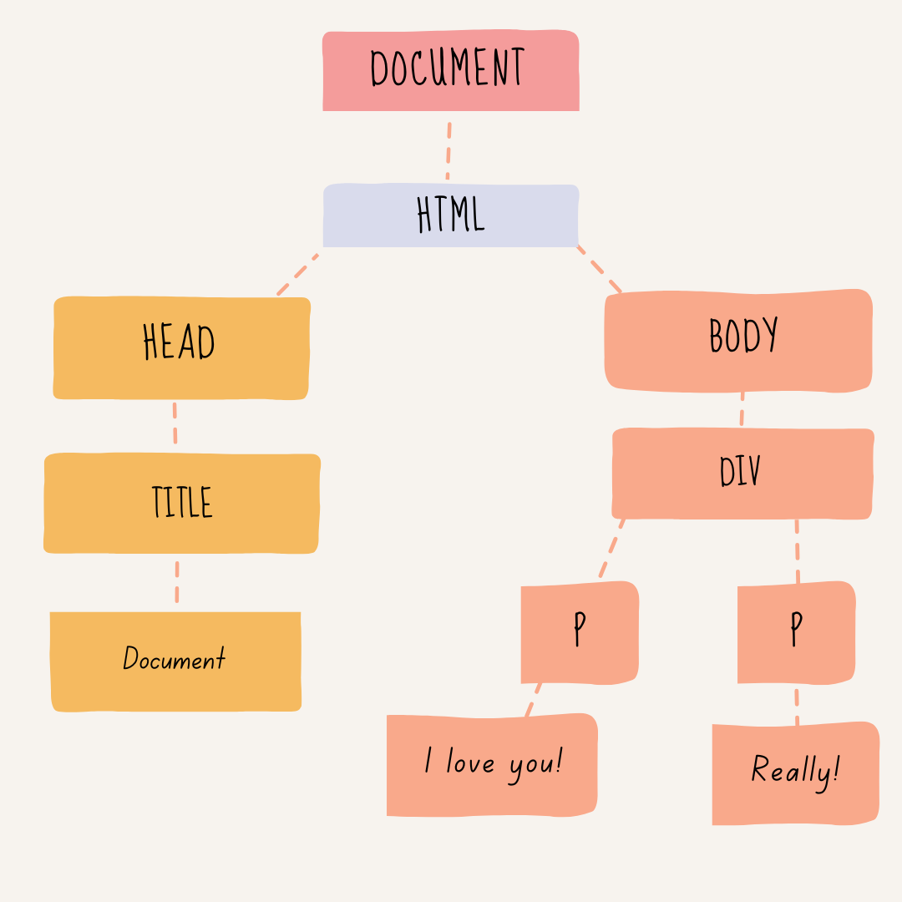

# The DOM

```html
1st level: document
2nd level:   <html>
3rd level:      <head>
4th level:        <title>
5th level:           Document
                  </title>
                </head>
3rd level:      <body>
4th level:        <div>
5th level:          <p>
6th level:            I love you!
                    </p>
5th level:          <p>
6th level:            Really!
                    </p>
                  </div>
                </body>
             </html>
```


