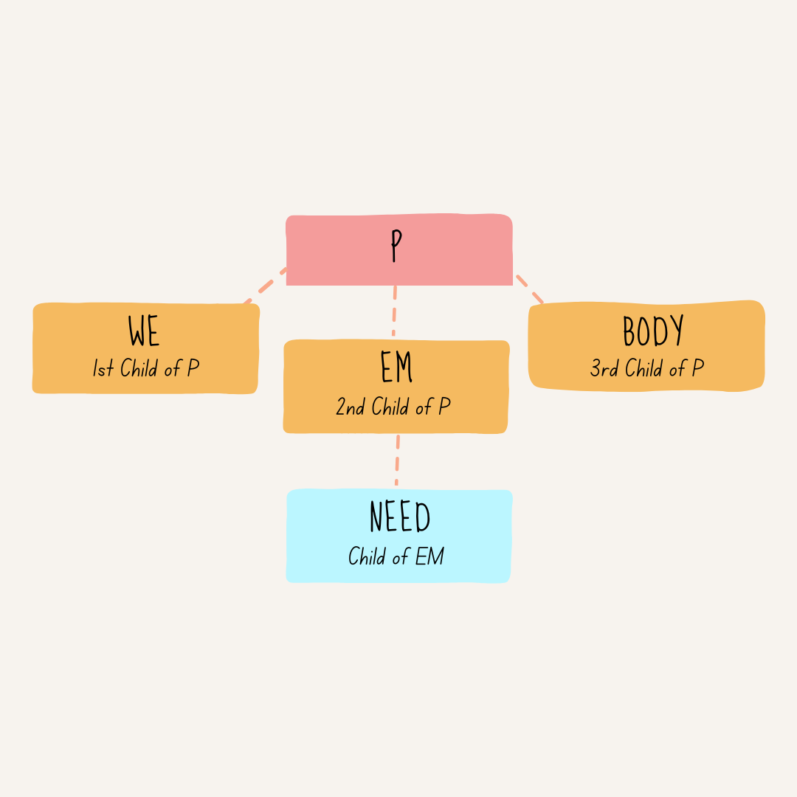

# The DOM

Every node enclosed with another is a child of the parent node.

```html
1st level: <p>
2nd level:   We 
3rd level:     <em>
4th level:       need
               </em> 
5th level:   to talk.
           </p>
```

